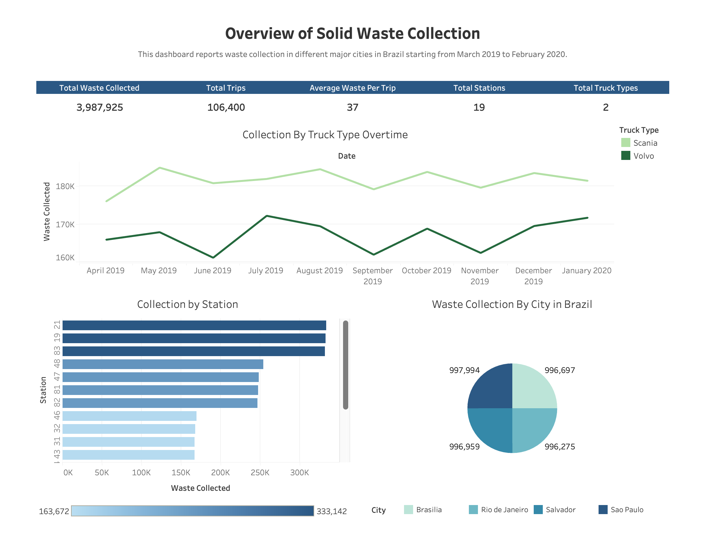

Hi there! Thank you for checking out my portfolio! I love learning new things and always seek development opportunities, so please feel free to reach out if you have any questions/feedback on my work :) 

**Contact**\
🔗 [`Linkedin`](https://www.linkedin.com/in/anna-phuong-tran/) \
📩 tranluunamphuong@gmail.com

## ⭐️ Portfolio Overview
- **[`DoorDash Delivery Data Analysis: Visualization, Insights, and Recommendations`](doordash-delivery-data-analysis.md)**
- **[`Data Warehousing and Reporting Dashboard for Solid Waste Management Company`](doordash-delivery-data-analysis.md)**

   
  
## 👋 About Me
### 👩🏻‍🏫 Personal Info
My name is Phuong Tran but I prefer to go by Anna. I am originally from Vietnam 🇻🇳. I embarked on my studying-abroad journey in 2019 to challenge myself living an independent life and to learn diverse perspectives from all walks of life. It has been an exciting and furious journey of self-growth, personally and professionally!!

### 🎓 Education Background
I am currently pursuing a Master's degree in Business Analytics at the University of Washington in Seattle ☔️. Before that, I graduated with a Bachelor of Business Administration degree, major in Finance, and a Business Data Analytics Certification from University of Massachusetts, Amherst ☃️.

### Work Experience

### 📊 Career Interest
I realized my passion for data analytics after I spent almost a year working as a Business Analyst at Wayfair in a co-op program. In this role, I learned how much I love delving into raw data and building technical tools to fuel impactful, actionable insights. I then went for the Master's degree in Business Analytics to make the transition into data and started working on several technical projects that enhance my strengths and learning.

### 👩🏻‍💻 Technical Skillset
**Database**:
 SQL, Python, Data Visualization (Tableau, Looker, Google Data Studio), Excel/Word/Powerpoint.

